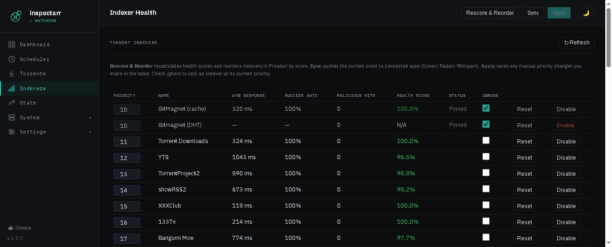
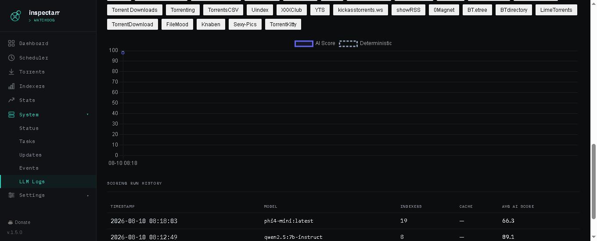

<p align="center">
  
</p>

<p align="center">
  <b>Torrent watchdog for *arr ecosystems</b><br>
  Detects bad downloads, blocklists them, and keeps your indexers honest.
</p>

<p align="center">
  <a href="https://github.com/o51r15/inspectarr/releases/latest"></a>
  <a href="https://github.com/o51r15/inspectarr/pkgs/container/inspectarr"></a>
  <a href="https://github.com/o51r15/inspectarr/actions"></a>
  <a href="https://github.com/o51r15/inspectarr/blob/main/LICENSE"></a>
</p>

---

## Why Inspectarr?

Sonarr, Radarr, and Lidarr can blocklist individual releases — but only *after* an import fails, and only within their own app. They have no cross-app rules, no way to catch a `.exe` sitting in a TV category before import is even attempted, and no visibility into which indexers keep serving bad content. Inspectarr fills that gap: it scans your torrent client directly, enforces file-level rules across all three apps at once, attributes bad grabs back to the indexer that served them, and uses that data to score, reorder, and auto-manage your Prowlarr indexers — optionally with a local LLM for deeper analysis. One container, zero cloud dependencies.

---

## What it does

Inspectarr watches your torrent client's categories, finds downloads that match bad-file
rules (`.exe` in a TV category, undersized files, suspicious filenames), blocklists
them in Sonarr / Radarr / Lidarr, deletes the torrent, and notifies you via [Apprise](https://github.com/caronc/apprise) (Pushover, Telegram, Discord, email, and 100+ services).
Supports **qBittorrent**, **Transmission**, and **Deluge** — select your client in Settings
and Inspectarr handles the rest. Scans can be triggered by a polling schedule, incoming
webhooks from your *arr apps, or both at the same time. Findings are graded by
severity, so you can delete outright only what is genuinely dangerous and hold
everything else on a review queue instead — or run the whole thing in
Monitor mode first and watch what it would have done before letting it act.

It also scores your Prowlarr torrent indexers by health — response time, failure
rate, malicious content, and grab success — then automatically reorders them so
your best indexers are searched first. Indexers that consistently score below a
configurable threshold are automatically disabled and re-enabled after a cooldown.
Optionally uses a local [Ollama](https://ollama.com) LLM for AI-powered scoring
with content-hash caching to minimize redundant calls.

---

## Features

- **Multi-client support** — qBittorrent, Transmission (JSON-RPC), and Deluge (Web UI JSON-RPC) with config-driven selection and per-client Settings UI
- **Bad torrent detection** — configurable rules per category: bad extensions, filename patterns, minimum file size
- **Automatic remediation** — blocklist in the *arr, delete from qBit, retry on failure
- **Operating modes** — one control for how far Inspectarr may act: **Monitor** (record findings, never act), **Quarantine** (hold for review, never delete), or **Automatic** (apply the thresholds). A banner on every page shows when the mode is holding the system back. It is a ceiling, not a preset — it never rewrites your thresholds and can only ever reduce an outcome
- **Severity grading** — every finding is graded (executables CRITICAL, archives HIGH, undersized primary file HIGH, filename patterns MEDIUM) and aggregated with MAX, so a pile of minor findings cannot dilute one dangerous file
- **Quarantine mode** — a middle band between "just record it" and "delete it": matching torrents are paused and held on a review queue until you decide. Optional timeout with a configurable action. Off by default — both thresholds ship at LOW, which reproduces the previous behaviour exactly
- **Webhook + polling** — receive push events from Sonarr/Radarr/Lidarr or poll on a schedule, or both
- **Prowlarr indexer health scoring** — weighted failure rates, logarithmic response time curve, malicious content tracking, grab success rate, historical trend analysis
- **AI-powered scoring** — optional Ollama integration with a dedicated Settings → AI pane, in-UI model selector and content-hash LLM caching. Ships **disabled**; one master switch turns every AI path off at once
- **Model validation** — before a model can be selected it is tested against the real scoring path for discrimination, schema compliance and context capacity at your actual indexer count. Results are kept per model so you can compare them
- **Replacement tracking** — after deleting a bad release, watches whether the *arr finds a replacement, which indexer served it, and whether that one passes inspection too. Answers the question a health score cannot: does this indexer's rubbish get replaced by something good, or by nothing at all
- **Grab attribution** — tracks which indexer served each torrent, increments malicious-hit counters automatically
- **Auto-reorder** — demotes bad indexers, promotes good ones, syncs to all connected apps
- **Auto-manage indexers** — automatically disable indexers that consistently score below a health threshold, re-enable after a configurable cooldown
- **Apprise notifications** — Pushover, Telegram, Discord, email, and [100+ services](https://github.com/caronc/apprise/wiki) with optional Ollama-narrated digests and periodic log summaries (daily/weekly)
- **Full web UI** — dashboard, scheduler, torrents, indexer health, quarantine review, stats, settings, backups, system status, update checker
- **Health endpoint** — `GET /api/health` for container orchestration; the fast path makes no outbound calls, `?deps=1` opts in to dependency checks
- **Mobile responsive** — works on phone and tablet
- **Docker-native** — single volume mount, GHCR images, non-root container, dev container CI
- **CLI daemon mode** — `--daemon` flag for headless operation with graceful SIGINT/SIGTERM shutdown

---

## Quick Start

### Docker Compose (recommended)

```yaml
services:
  inspectarr:
    image: ghcr.io/o51r15/inspectarr:latest  # or :dev for bleeding edge
    container_name: inspectarr
    user: "${PUID:-1000}:${PGID:-1000}"
    restart: unless-stopped
    ports:
      - "8585:8585"
    volumes:
      - ./data:/app/data
      - ./config.yaml:/app/config.yaml
```

```bash
cp config.example.yaml config.yaml   # edit with your URLs and credentials
docker compose up -d
```

Open `http://your-server:8585`. The scheduler starts **stopped** — configure and verify your settings first, then start it from the dashboard.

> **Tip:** Set `user` to your host UID:GID (`id -u`:`id -g`) so mounted volumes are writable. The compose file defaults to `1000:1000`.

### Docker Run

```bash
docker run -d --name inspectarr \
  --user "$(id -u):$(id -g)" \
  -p 8585:8585 \
  -v ./data:/app/data \
  -v ./config.yaml:/app/config.yaml \
  ghcr.io/o51r15/inspectarr:latest
```

### From Source

```bash
git clone https://github.com/o51r15/inspectarr.git && cd inspectarr
pip install -r requirements.txt
cp config.example.yaml config.yaml
python3 web.py
```

---

## Web UI

Dark and light themes with toggle. Works on desktop and mobile.

| Page | Purpose |
|---|---|
| **Dashboard** | Scheduler status, scan stats, last flagged torrent, run history |
| **Torrents** | Browse qBittorrent — filter, pause, resume, delete, detail view |
| **Indexers** | Health scores, rescore, reorder & sync, per-indexer ignore/reset |
| **Quarantine** | Review queue for held torrents — release, keep paused, or delete + blocklist |
| **Stats** | Grab attribution — total grabs, malicious hits, % malicious per indexer |
| **Settings** | Connections, rules + operating mode + remediation thresholds, indexers, AI (Ollama + model validation), notifications, general, advanced, backups |
| **System** | Status, scheduled tasks, update checker, LLM logs |
| **Events** | Paginated log viewer with level filter and JSON export |
| **LLM Logs** | AI scoring report card with per-indexer reasoning, score trend charts, run history |

Settings are saved to `config.yaml` and take effect on the next scan cycle — no restart needed.

<p align="center">
  
  <br><em>Dashboard — scheduler status, scan stats, run history</em>
</p>

<p align="center">
  
  <br><em>Indexer Health — scores, response times, actions</em>
</p>

<p align="center">
  
  <br><em>LLM Logs — AI scoring report card with per-indexer reasoning</em>
</p>

---

## CLI

```bash
python3 inspectarr.py                    # single scan
python3 inspectarr.py --test             # test every configured connection, then exit
python3 inspectarr.py --dry-run          # log matches, take no action
python3 inspectarr.py --retry-now        # flush retry queue, then scan
python3 inspectarr.py --daemon           # continuous loop with graceful shutdown
python3 inspectarr.py --config /path     # alternate config file
```

---

## Indexer Health Scoring

Each torrent indexer gets a **0–100% health score** from six signals:

| Signal | What it measures | Weight |
|---|---|---|
| Response time | Logarithmic curve — gentle on fast, harsh on slow | 0.25 |
| Failure rate | Weighted by type: auth 3×, grab 2×, query 1×, RSS 0.5× | 0.30 |
| Malicious rate | Flagged hits ÷ total grabs (normalized across volumes) | 0.20 |
| Grab success | Distinct grab success rate | 0.25 |
| Backoff penalty | Flat −20 if indexer is in Prowlarr backoff | — |
| Trend | Linear regression over last 30 snapshots, ±10 | — |

When [Ollama](https://ollama.com) is configured, the LLM receives all per-indexer data and returns its own score with reasoning. Results are cached by content hash with a configurable TTL (`cache_ttl_hours`), cutting Ollama calls 60–80% on stable homelabs. Select your model from **Settings → Indexers → AI Model**. Falls back to deterministic scoring silently on any failure.

Indexers that consistently score below a configurable threshold are automatically disabled in Prowlarr and re-enabled after a cooldown period. Manual override is available from the Indexers page.

All weights, multipliers, and thresholds are configurable. See the [wiki](https://github.com/o51r15/inspectarr/wiki/Prowlarr-Indexer-Scoring) for the full breakdown.

<p align="center">
  
  <br><em>AI Score trends — track how LLM scores change over time per indexer</em>
</p>

---

## Requirements

- **One of:** qBittorrent (v4.x/v5.x, Web UI enabled), Transmission (with RPC enabled), or Deluge (with Web UI enabled)
- **One or more of:** Sonarr v4, Radarr v3, Lidarr v2
- **Prowlarr** *(optional)* — for indexer scoring and grab attribution
- **Ollama** *(optional)* — for AI-powered health scoring
- **Python 3.12+** *(only if running from source)*

---

## Configuration

All settings live in `config.yaml` — copy `config.example.yaml` to get started. Most options are also editable from the web UI Settings page.

See the [Configuration wiki page](https://github.com/o51r15/inspectarr/wiki/Configuration) for every option.

---

## Persistent Data

Mount `data/` as a volume — it holds everything Inspectarr remembers:

| File | Contents |
|---|---|
| `inspectarr.db` | SQLite — processed hashes, retry queue, run history, indexer stats, score history |
| `inspectarr.log.json` | JSON Lines event log |
| `data/backups/` | Timestamped zip backups (config + database) created from the UI |

---

## Docker Images

| Tag | When it's built |
|---|---|
| `ghcr.io/o51r15/inspectarr:latest` | On tagged releases |
| `ghcr.io/o51r15/inspectarr:dev` | On every push to `main` |

A [dev container](https://containers.dev/) config is included for VS Code / Codespaces.

---

## Links

- [Wiki](https://github.com/o51r15/inspectarr/wiki) — installation, configuration, scoring, rules, troubleshooting
- [Issues](https://github.com/o51r15/inspectarr/issues) — bugs and feature requests
- [Releases](https://github.com/o51r15/inspectarr/releases) — changelog and downloads

---

## License

[MIT](LICENSE)
