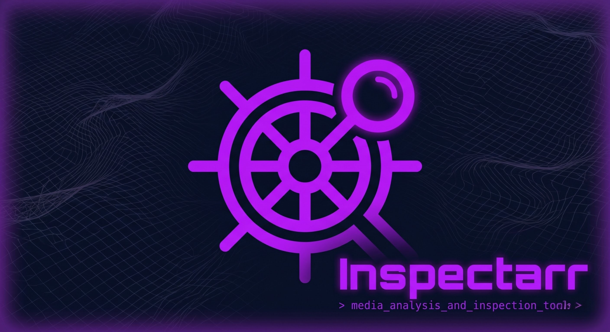

<p align="center">
  
</p>

# inspectarr

Torrent watchdog for *arr ecosystems. Polls qBittorrent categories, detects
downloads that match configurable bad-file rules (e.g. `.exe` files in a TV
category), blocklists them in Sonarr, Radarr, or Lidarr, deletes the torrent and
files, logs all events to JSON Lines, and notifies via Pushover.

Runs two ways: a **web UI with a built-in scheduler daemon** (`web.py`), or a
**one-shot CLI** (`inspectarr.py`) for manual runs and testing.

---

## Quick Start (Web UI)

```bash
cp config.example.yaml config.yaml
# edit config.yaml with your URLs, credentials, and rules
pip install -r requirements.txt
python3 web.py
```

Open `http://<host>:8585`. The scheduler starts **off** — enable it from the
dashboard once you've confirmed your config and categories are correct.

## Quick Start (CLI)

```bash
cp config.example.yaml config.yaml
python3 inspectarr.py --dry-run    # confirm matches without deleting
python3 inspectarr.py              # live run
```

## Requirements

- Python 3.12+
- qBittorrent with Web UI enabled
- Sonarr v4

```bash
pip install -r requirements.txt   # requests, pyyaml, flask
```

---

## Web UI

Served on port `8585` by default (configurable via `web.port`). Four pages:

| Page | What it does |
|---|---|
| **Dashboard** | Scheduler status, last-scan stats (checked / flagged / actioned), last flagged torrent, recent run history. Live-updates every 5s. |
| **Scheduler** | Start/stop the daemon, run-now, poll interval, last/next run, run history. |
| **Logs** | Paginated JSON Lines viewer (100/page), level filter, color-coded badges, auto-refresh, clear-log. |
| **Config** | Full form editor for every option, plus a raw-YAML mode for advanced edits. Test-connection buttons for qBittorrent, Sonarr, Radarr, and Lidarr. Rules are a dynamic add/remove builder. |

The scheduler reloads `config.yaml` from disk before every scan, so changes
saved in the Config page take effect on the next cycle — no restart needed.
Changing `web.port` is the one exception; that requires a restart.

---

## Docker

The container runs the web UI + scheduler by default.

```bash
docker build -t inspectarr .
docker run -d \
  --name inspectarr \
  -p 8585:8585 \
  -v ./data:/app/data \
  -v ./config.yaml:/app/config.yaml \
  inspectarr
```

Or with Docker Compose (using the included `docker-compose.yml`):

```bash
docker compose up -d
```

To run a one-off CLI scan against a running container:

```bash
docker exec inspectarr python inspectarr.py --dry-run
```

---

## Systemd (auto-start on boot)

A `inspectarr.service` unit file is included. Copy it and enable it:

```bash
sudo cp inspectarr.service /etc/systemd/system/
```

Then enable and start:

```bash
sudo systemctl daemon-reload
sudo systemctl enable inspectarr
sudo systemctl start inspectarr
```

Check status and logs:

```bash
sudo systemctl status inspectarr
sudo journalctl -u inspectarr -f
```

---

## Configuration

See `config.example.yaml` for all options with inline documentation.

Key settings:

| Setting | Purpose |
|---|---|
| `rules[].conditions.match_mode` | `any` = flag on any bad file; `primary` = only if largest file is bad |
| `rules[].conditions.bad_extensions` | List of file extensions to flag (e.g. `.exe`, `.zip`) |
| `rules[].conditions.min_file_size_mb` | Flag if the primary (largest) file is below this size in MB |
| `rules[].conditions.bad_filename_patterns` | List of regex patterns matched against filenames |
| `on_arr_failure` | `delete` = remove from qBit anyway; `abort` = skip and retry |
| `poll_interval_seconds` | How often the scheduler daemon scans (default: 300) |
| `retry.max_attempts` | How many times to retry before giving up (default: 10) |
| `retry.interval_seconds` | Seconds between retry attempts (default: 600) |
| `web.port` | Web UI port (default: 8585) |
| `web.scheduler_autostart` | `true` = start the scheduler automatically on launch (default: false) |
| `dry_run` | `true` = log matches only, no deletions |

---

## CLI Flags

```
python3 inspectarr.py                    # single scan run
python3 inspectarr.py --config /path     # alternate config location
python3 inspectarr.py --dry-run          # override config dry_run=true
python3 inspectarr.py --daemon           # not in the CLI — use web.py instead
python3 inspectarr.py --retry-now        # force flush retry queue, then scan
```

The continuous scheduler lives in `web.py`; the CLI is single-shot only.

---

## Persistent Data

Everything in `data/` — mount as a Docker volume:

| File | Contents |
|---|---|
| `inspectarr.db` | SQLite: processed hashes + retry queue |
| `inspectarr.log.json` | JSON Lines: one event object per line |

---

## Extending to Other *arrs

Sonarr, Radarr, and Lidarr are all supported. To add a new *arr app (e.g. Prowlarr):

1. Implement `core/arrs/<app>.py` mirroring `sonarr.py` against the target API
2. Register it in `_build_arr_client()` in `core/scanner.py`
3. Add config fields to `ArrsConfig` in `core/config.py`
4. Set `arrs.<app>.enabled: true` in config and add rules with `app: <app>`

The abstract base and scanner already handle the rest.

---

## Project Layout

```
inspectarr/
├── inspectarr.py            # CLI entry point (single-shot)
├── web.py                   # Web UI + scheduler daemon entry point
├── core/                    # Core logic — no awareness of the UI
│   ├── config.py            # Config loader + dataclasses
│   ├── scanner.py           # Main orchestrator
│   ├── rules.py             # Rule evaluation engine
│   ├── qbit.py              # qBittorrent Web API v2 client
│   ├── arrs/
│   │   ├── base.py          # AbstractArrClient
│   │   ├── sonarr.py        # Sonarr v4 client
│   │   ├── radarr.py        # Radarr v3 client
│   │   └── lidarr.py        # Lidarr v2 client
│   ├── notifier.py          # Pushover client
│   └── state.py             # SQLite + JSON Lines log
├── ui/                      # Web UI layer
│   ├── scheduler.py         # Background scheduler daemon thread
│   ├── routes/              # Flask blueprints (dashboard, config, logs, scheduler)
│   ├── templates/           # Jinja2 templates
│   └── static/              # CSS + JS + logo.png
├── assets/
│   └── inspectarr-banner.jpg
├── config.example.yaml
├── docker-compose.yml
├── inspectarr.service
├── data/                    # Runtime state (gitignored, Docker volume)
├── Dockerfile
└── requirements.txt
```
