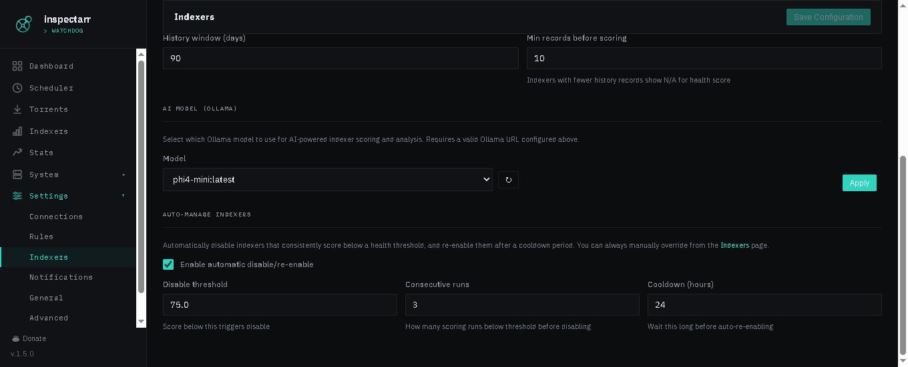

All configuration lives in `config.yaml`. The repo ships a fully annotated `config.example.yaml` — copy it and edit. Most options are also editable from the [Web UI](Web-UI) Settings page, which writes back to the same file. The scheduler reloads `config.yaml` from disk before every scan, so changes take effect on the next cycle without a restart. The one exception is `web.port`, which requires a restart.

---

## Connections

```yaml
qbittorrent:
  url: http://192.168.1.100:8080
  username: admin
  password: changeme

arrs:
  sonarr:
    enabled: true
    url: http://192.168.1.100:8989/sonarr     # include the base path if you use one
    api_key: your_api_key
  radarr:
    enabled: true
    url: http://192.168.1.100:7878/radarr
    api_key: your_api_key
  lidarr:
    enabled: false
    url: ~
    api_key: ~
```

| Setting | Purpose |
|---|---|
| `qbittorrent.url` | qBittorrent Web UI URL including port |
| `qbittorrent.username` / `password` | qBittorrent Web UI credentials |
| `arrs.<app>.enabled` | Whether this \*arr client is active |
| `arrs.<app>.url` | The \*arr URL, **including any base path** (e.g. `/radarr`) |
| `arrs.<app>.api_key` | Found in the \*arr under Settings → General |

---

## Rules

Rules decide what counts as a bad torrent. Each rule watches one qBittorrent category and ties it to one \*arr app. See [Rules](Rules) for the full breakdown.

```yaml
rules:
  - name: "TV Bad Extensions"
    category: "tv-sonarr"
    app: sonarr
    conditions:
      match_mode: any
      bad_extensions: [".exe", ".bat", ".msi", ".scr", ".lnk"]
      min_file_size_mb: ~
      bad_filename_patterns: []
```

---

## Scanning

Controls how and when Inspectarr checks for new torrents. Polling and webhooks are independent — you can use either or both.

```yaml
scanning:
  polling:
    enabled: true
    interval_seconds: 300
  webhooks:
    enabled: false
    secret: ""
    scan_delay_seconds: 60
```

| Setting | Purpose |
|---|---|
| `scanning.polling.enabled` | Whether the scheduler polls on an interval (default `true`) |
| `scanning.polling.interval_seconds` | Seconds between scheduled scans (default 300) |
| `scanning.webhooks.enabled` | Accept incoming webhook push events from \*arr apps (default `false`) |
| `scanning.webhooks.secret` | Shared secret for HMAC validation — leave empty to skip validation |
| `scanning.webhooks.scan_delay_seconds` | Delay after receiving a webhook before scanning, to let the torrent connect to the swarm (default 60) |

When webhooks are enabled, Inspectarr listens on `POST /webhook/sonarr`, `/webhook/radarr`, and `/webhook/lidarr`. Configure your \*arr app's Connect settings to point at these URLs. The webhook URLs are shown on the Scheduler page.

> **Backward compatibility:** If you have `poll_interval_seconds` at the top level from an older config, it still works — the value is used as the default for `scanning.polling.interval_seconds`.

---

## Behavior

```yaml
on_arr_failure: delete
dry_run: false
```

| Setting | Purpose |
|---|---|
| `on_arr_failure` | `delete` removes the torrent from qBittorrent even if the \*arr blocklist call fails; `abort` skips deletion and queues a retry |
| `dry_run` | `true` logs matches but takes no action — ideal for testing a new rule |

---

## Retry

```yaml
retry:
  enabled: true
  max_attempts: 10
  interval_seconds: 600
```

When an \*arr call fails and `on_arr_failure` is `abort`, the torrent is queued and retried up to `max_attempts` times, `interval_seconds` apart.

---

## Notifications

See [Notifications](Notifications) for Pushover setup.

```yaml
notifications:
  pushover:
    enabled: true
    app_token: your_app_token
    user_key: your_user_key
    notify_on: [action, error, startup, dry_run]
    priority: 0
  digest:
    enabled: false
    use_ollama: false
  summary:
    enabled: false
    schedule: daily
    use_ollama: true
```

| Setting | Purpose |
|---|---|
| `notifications.pushover.*` | Standard Pushover notification settings |
| `notifications.digest.enabled` | Batch notifications into a single digest instead of sending individually |
| `notifications.digest.use_ollama` | Use Ollama to generate a natural-language digest summary |
| `notifications.summary.enabled` | Generate periodic summaries of recent activity |
| `notifications.summary.schedule` | `daily` or `weekly` |
| `notifications.summary.use_ollama` | Use Ollama for natural-language summary narration |

---

## Prowlarr

Enables indexer health scoring, auto-reorder, auto-manage, and grab attribution. See [Prowlarr Indexer Scoring](Prowlarr-Indexer-Scoring) for the full explanation of each weight.

```yaml
prowlarr:
  enabled: true
  url: http://192.168.1.100:9696/prowlarr
  api_key: your_api_key
  base_priority: 10
  reorder_interval_hours: 24
  min_grabs_before_scoring: 10
  scoring:
    response_time_weight: 0.25
    failure_rate_weight: 0.30
    malicious_weight: 0.20
    grab_success_weight: 0.25
    auth_failure_mult: 3.0
    grab_failure_mult: 2.0
    query_failure_mult: 1.0
    rss_failure_mult: 0.5
    backoff_penalty: 20
    malicious_penalty_per_hit: 10
```


| Setting | Purpose |
|---|---|
| `prowlarr.enabled` | Master switch for indexer health scoring |
| `prowlarr.url` | Prowlarr URL including any base path |
| `prowlarr.api_key` | Prowlarr API key (Settings → General) |
| `prowlarr.base_priority` | Priority assigned to the top-ranked indexer; others count up from here |
| `prowlarr.reorder_interval_hours` | Hours between automatic priority reorders (default 24) |
| `prowlarr.min_grabs_before_scoring` | Minimum history records before an indexer is scored (default 10) |

### Scoring weights

Four weights that must sum to 1.0:

| Weight | Default | Measures |
|---|---|---|
| `response_time_weight` | 0.25 | Average API response time |
| `failure_rate_weight` | 0.30 | Weighted failure rate across failure types |
| `malicious_weight` | 0.20 | Rate of malicious content served |
| `grab_success_weight` | 0.25 | Ratio of successful grabs to total grabs |

Failure type multipliers control how heavily each failure type counts toward the failure rate sub-score:

| Multiplier | Default | Severity |
|---|---|---|
| `auth_failure_mult` | 3.0 | Auth failures — most severe |
| `grab_failure_mult` | 2.0 | Grab failures |
| `query_failure_mult` | 1.0 | Query failures (baseline) |
| `rss_failure_mult` | 0.5 | RSS failures — least severe |

Additional penalties:

| Setting | Default | Purpose |
|---|---|---|
| `backoff_penalty` | 20 | Points deducted if the indexer is currently in Prowlarr backoff |
| `malicious_penalty_per_hit` | 10 | Points deducted per confirmed malicious torrent |

### Ollama (AI scoring)

When configured, Ollama analyzes indexer data and produces an AI-powered health score. If Ollama is unreachable or not configured, the deterministic formula above is used automatically.

```yaml
  ollama:
    url: http://192.168.1.125:11434
    model: gemma3:latest
    timeout: 120
    cache_ttl_hours: 24
```

| Setting | Default | Purpose |
|---|---|---|
| `ollama.url` | `""` | Ollama API endpoint |
| `ollama.model` | `""` | Model name — must be set explicitly |
| `ollama.timeout` | 120 | Seconds — hard cutoff per scoring run |
| `ollama.cache_ttl_hours` | 24 | How long to cache LLM scoring results before re-querying |

AI scoring runs are logged to the database and visible on the [LLM Logs](LLM-Logs) page under System. The model can also be changed from the Settings → Indexers pane in the web UI.



### Auto-manage

Automatically disables indexers that consistently score below a threshold and re-enables them after a cooldown. Auto-manage runs after every scan cycle independently of the reorder interval.

```yaml
  auto_manage:
    enabled: false
    disable_threshold: 30.0
    consecutive_runs: 3
    cooldown_hours: 24
```

| Setting | Default | Purpose |
|---|---|---|
| `auto_manage.enabled` | `false` | Enable automatic disable/re-enable |
| `auto_manage.disable_threshold` | 30.0 | Health score below which an indexer is flagged |
| `auto_manage.consecutive_runs` | 3 | Must score below threshold this many consecutive cycles before being disabled |
| `auto_manage.cooldown_hours` | 24 | Hours before a disabled indexer is automatically re-enabled |

You can always manually override from the [Indexers](http://localhost:8585/indexers) page.

---

## Web UI

```yaml
web:
  port: 8585
  scheduler_autostart: false
  auth:
    enabled: false
    username: admin
    password: changeme
```

| Setting | Default | Purpose |
|---|---|---|
| `web.port` | 8585 | HTTP port for the web UI (**requires restart** to change) |
| `web.scheduler_autostart` | `false` | Start the scan scheduler automatically when the web UI launches |
| `web.auth.enabled` | `false` | Password-protect the web UI |
| `web.auth.username` | `admin` | Login username |
| `web.auth.password` | `changeme` | Login password |

---

## Advanced

These settings rarely need changing.

```yaml
logging:
  log_file: ./data/inspectarr.log.json
  retention_days: 30
  level: INFO

state:
  db_file: ./data/inspectarr.db
```

| Setting | Default | Purpose |
|---|---|---|
| `logging.log_file` | `./data/inspectarr.log.json` | Path to the JSON Lines log file |
| `logging.retention_days` | 30 | Days before old log entries and state records are pruned |
| `logging.level` | `INFO` | `DEBUG` for verbose output |
| `state.db_file` | `./data/inspectarr.db` | Path to the SQLite state database |
