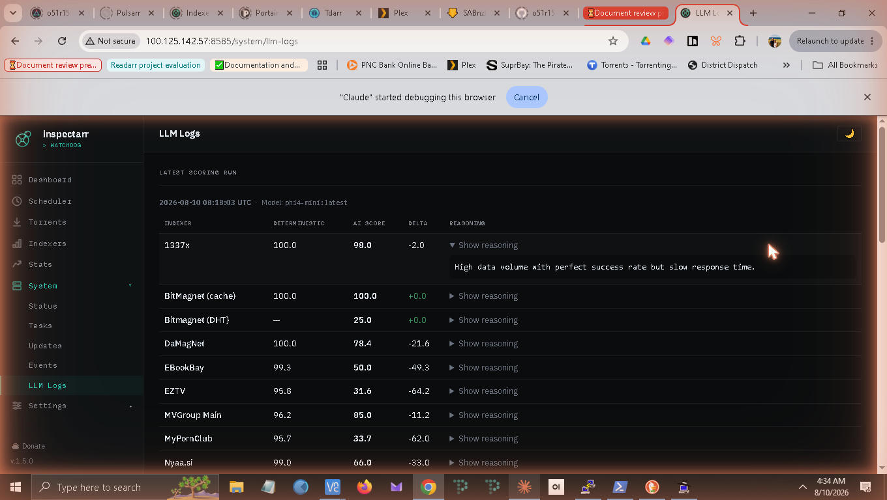

The LLM Logs page lives under **System → LLM Logs** and makes AI scoring output visible. It only appears when Ollama is configured under `prowlarr.ollama` in your `config.yaml`.

Every time Inspectarr runs AI scoring, the results are recorded to the database — the model used, each indexer's deterministic and AI scores, and the LLM's reasoning text. This page surfaces all of that data.

## Latest Scoring Run

A report card for the most recent AI scoring run. Each row shows one indexer with:

| Column | Description |
|---|---|
| Indexer | The indexer name from Prowlarr |
| Deterministic | The formula-based health score (0–100) |
| AI Score | The LLM's health score (0–100) — this is what actually gets applied |
| Delta | Difference between AI and deterministic (green = AI scored higher, red = lower) |
| Reasoning | Expandable — click "Show reasoning" to see the LLM's one-sentence explanation |

The header shows the run timestamp, which Ollama model was used, and whether the result came from cache.

## AI Score Trends

Below the report card is a row of indexer chips — one per indexer that has been scored. Click any chip to load a Chart.js line graph showing that indexer's AI score (solid purple line) and deterministic score (dashed gray line) over time. This makes it easy to spot drift between the LLM's assessment and the formula, or to see whether an indexer is trending up or down.

The chart pulls data from `/api/llm-logs/history/<indexer_id>`, which returns up to 30 data points (oldest first).

## Scoring Run History

A table at the bottom listing every AI scoring run in reverse chronological order:

| Column | Description |
|---|---|
| Timestamp | When the run happened (UTC) |
| Model | Which Ollama model was used |
| Indexers | How many indexers were scored in that run |
| Cache | Whether the run used cached results (✓) or queried Ollama fresh (—) |
| Avg AI Score | Average AI score across all indexers in the run |

## Data retention

LLM scoring log entries follow the same retention policy as the rest of the state database, controlled by `logging.retention_days` (default 30). Older entries are pruned automatically.

## Troubleshooting

If the page says "No AI scoring runs recorded yet," check that:

1. `prowlarr.ollama.url` and `prowlarr.ollama.model` are set in your config
2. The Ollama server is reachable from the Inspectarr container
3. A scoring run has actually been triggered (either by the scheduler or manually from the Indexers page via Rescore)

If reasoning shows "(none)" for all indexers, the Ollama model may not be following the output schema. Try a different model — `phi4-mini:latest` and `qwen2.5:7b-instruct` are known to work well. You can change the model from **Settings → Indexers → Ollama Model**.
