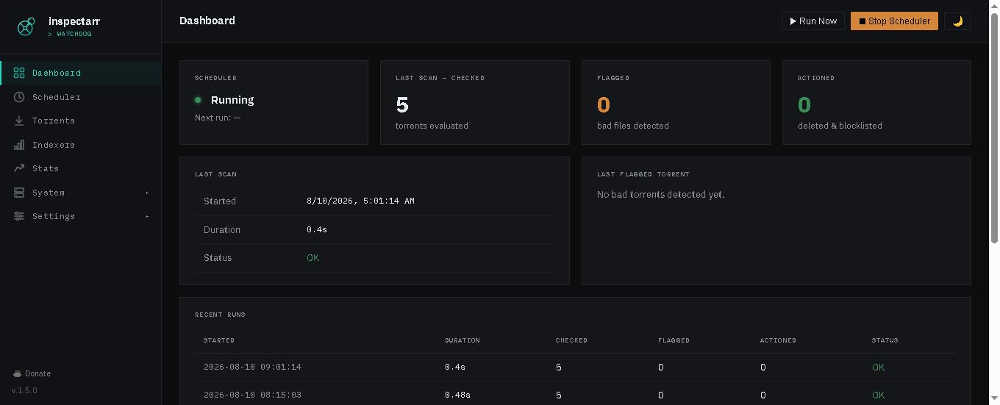
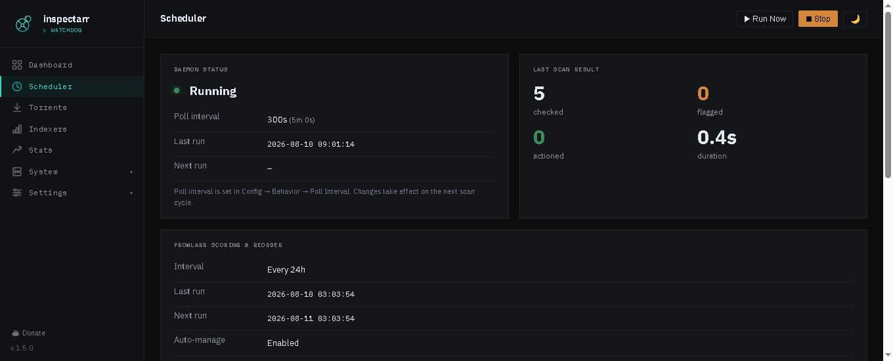

Inspectarr ships a web UI on port 8585 (configurable via `web.port`). All pages share a sidebar navigation with a dark/light theme toggle (moon/sun icon in the top right).

## Pages

### Dashboard

The landing page. Shows scheduler status, scan stats (Flagged and Actioned counts with retention period), last flagged torrent (with a Historical tab showing all past flagged torrents), and recent run history.

### Torrents

Lists all torrents currently tracked in your torrent client's categories that match your rules. Click a torrent to see file-level detail, including which files triggered a match and why. Works with qBittorrent, Transmission, and Deluge.

### Scheduler

Controls the scan scheduler. From here you can:

- **Start / Stop** the scheduler
- See the current polling interval and next scheduled scan
- View webhook URLs (when `scanning.webhooks.enabled` is `true`) — copy these into your *arr apps under Connect → Webhook
- Trigger a manual scan

### Indexers

Prowlarr indexer health scoring dashboard. See [Prowlarr Indexer Scoring](Prowlarr-Indexer-Scoring) for full details. Only visible when `prowlarr.enabled` is `true`. Actions: Rescore, Reorder & Sync, Ignore toggle, Reset stats, Enable/Disable.

### Logs

Displays the JSON Lines log with filtering by level and event type. Includes a log summary feature — when Ollama is configured, you can generate a natural-language summary of recent activity.

### Stats

Charts and statistics for scan history, match rates, and action counts over time.

### Settings (Config)

Edit `config.yaml` from the browser. Changes are written to disk and picked up on the next scan cycle (no restart needed, except for `web.port`). The Connections pane includes a torrent client selector (qBittorrent, Transmission, or Deluge) with per-client URL, username, and password fields plus a Test Connection button. Only the active client's fields are shown. Other tabs cover rules, scanning, behavior, retry, notifications, and Prowlarr settings.

### System → Status

Shows the current Inspectarr version, Python version, uptime, and system resource usage.

### System → Tasks

An *arr-style scheduled tasks view showing background jobs (scan cycles, reorder runs, digest generation) with their last run time, next run time, and status.

### System → Updates

Checks GitHub releases for newer versions. Displays the current version, latest available release, and a changelog summary.

### System → LLM Logs

Displays AI scoring output and history. Only visible when Ollama is configured under `prowlarr.ollama`. See [LLM Logs](LLM-Logs) for details. Three sections:

- **Latest Scoring Run** — Report card showing every indexer's deterministic score, AI score, delta, and the LLM's reasoning (expandable per row)
- **AI Score Trends** — Click any indexer chip to see a Chart.js line graph of its AI score vs deterministic score over time
- **Scoring Run History** — Table of all past runs with timestamp, model used, indexer count, cache status, and average AI score

### System → Backups

Create and download backups of your `config.yaml` and SQLite state database. Backups are stored in `./data/backups/`.

## Authentication

Set `web.auth.enabled: true` in your config to password-protect the UI. The default credentials are `admin` / `changeme` — change them before exposing the UI outside your LAN.

## Mobile

The UI is responsive and works on mobile devices. The sidebar collapses into a hamburger menu on narrow screens.
